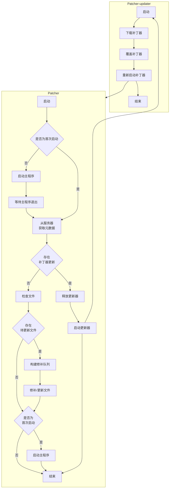

# AviUtlPatcher

Auto patcher for AviUtl (CN)

AviUtl中文版自动修补/更新程序。

首次启动时，将自动下载最新版AviUtl并启动。

之后，在每次关闭AviUtl时，将自动检查文件并更新任何可用的补丁。

```mermaid

flowchart TB;


subgraph Patcher-updater

    s-updater[启动] --> download-patcher[下载补丁器] --> overwrite-patcher[覆盖补丁器] --> restart-patcher[重新启动补丁器] --> e-updater[结束]

end

subgraph Patcher

    s-patcher[启动] --> first-startup-1{是否为首次启动} --否--> startup-1[启动主程序] --> wait-exit[等待主程序退出] --> fetch-meta[从服务器<br/>获取元数据] --> update-1{存在<br/>补丁器更新} --否--> check-file[检查文件] --> patch-1{存在<br/>待更新文件} --否--> first-startup-2{是否为<br/>首次启动} --否--> e-patcher[结束] 

    first-startup-2 --是--> startup-2[启动主程序] --> e-patcher

    patch-1 --是--> queue-patch[构建修补队列] --> patch-file[修补/更新文件] --> first-startup-2

    update-1 --是--> release-updater[释放更新器] --> start-updater[启动更新器] --> e-patcher

    first-startup-1 --是--> fetch-meta

end

start-updater --> s-updater

restart-patcher --> Patcher

```
